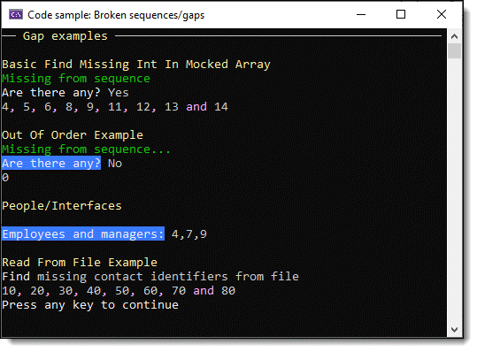

# About

This project provides basic code samples for finding gaps in `int` sequences from an array, working with classes/models read from files.

# See also

[.NET Fiddle](https://dotnetfiddle.net/4o8uRi) working samples