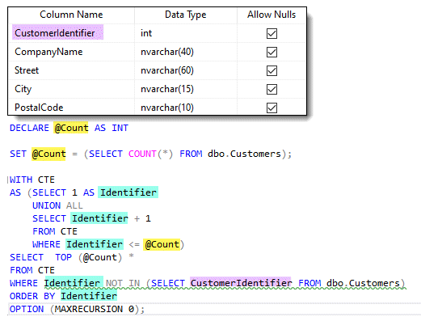

# Find gap in a SQL-Server table

:red_circle: Before running the project run the script `Script1.sql`

This project shows one way to find missing primary keys in a table using the following SQL statements done in SSMS (SQL-Server Management Studio).

Before looking at the code below it is important to not write these statements in code, instead in this case use SSMS as per below which is color coded to better understand.




```sql
DECLARE @Count AS INT 

SET @Count = (SELECT COUNT(*) FROM dbo.Customers);

WITH CTE
AS (SELECT 1 AS Identifier
    UNION ALL
    SELECT Identifier + 1
    FROM CTE
    WHERE Identifier <= @Count)
SELECT  TOP (@Count) *
FROM CTE
WHERE Identifier NOT IN (SELECT CustomerIdentifier FROM dbo.Customers)
ORDER BY Identifier
OPTION (MAXRECURSION 0);
```

Which in DataOperations class, GetMissingSequence method translated into two statements, first get record count than find missing sequences.

```csharp
public class DataOperations
{
    public static async Task<List<int>> GetMissingSequence()
    {
        List<int> list = new();
        /*
         * IMPORTANT: replace ForumExample with your table name as per in Script1.sql
         * in the root of the project.
         */
        string connectionString = "Data Source=.\\SQLEXPRESS;Initial Catalog=ForumExample;integrated security=True;Encrypt=False";


        await using var cn = new SqlConnection(connectionString);
        await using var cmd = new SqlCommand { Connection = cn, CommandText = "SELECT COUNT(*) FROM dbo.Customers" };

        await cn.OpenAsync();
        var count =  Convert.ToInt32(cmd.ExecuteScalar());

        cmd.CommandText = GetMissingStatement;
        cmd.Parameters.Add("@Count", SqlDbType.Int).Value = count;

        var reader = await cmd.ExecuteReaderAsync();
        if (reader.HasRows)
        {
            while (reader.Read())
            {
                list.Add(reader.GetInt32(0));
            }
        }

        return list;
    }

    private static string GetMissingStatement =>
        @"WITH CTE 
AS (SELECT 1 AS Identifier
    UNION ALL
    SELECT Identifier + 1
    FROM CTE
    WHERE Identifier <= @Count)
SELECT  TOP (@Count) *
FROM CTE
WHERE Identifier NOT IN (SELECT CustomerIdentifier FROM dbo.Customers)
ORDER BY Identifier
OPTION (MAXRECURSION 0);";
}
```

# Requires

- .NET Core 6
- Microsoft Visual Studio 2022 or higher

